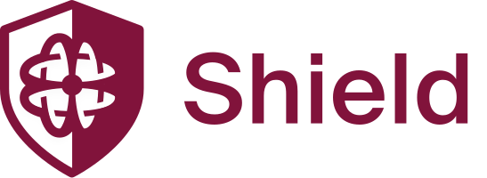

<div align="center">



### The private bridge that screens people, not just tokens

Move assets from Ethereum to Aztec privately, with proof-of-personhood and proof-of-innocence enforced at both entry and exit.

[](#license)
[](https://www.npmjs.com/package/@human.tech/clean.sdk)
[](https://docs.aztec.network/)
[](#audits)
[](https://shield.human.tech)

[**Launch the app**](https://shield.human.tech) &nbsp;·&nbsp; [**Product**](https://human.tech/shield) &nbsp;·&nbsp; [**Docs**](https://docs.holonym.id/for-developers/clean-hands) &nbsp;·&nbsp; [**Clean SDK on npm**](https://www.npmjs.com/package/@human.tech/clean.sdk) &nbsp;·&nbsp; [**Testnet**](https://testnet.shield.human.tech/)

</div>

---

Shield is a privacy-preserving bridge between Ethereum (L1) and Aztec (L2). It is the first application built on the [Clean SDK](https://www.npmjs.com/package/@human.tech/clean.sdk) (`@human.tech/clean.sdk`), and it is **live on mainnet**.

Most privacy tools face a hard trade-off: shield user activity and you also shield bad actors. Shield takes a different approach. It verifies the **person** on the way in and on the way out, so honest users get real privacy while sanctioned addresses and Sybil actors are screened at the door. The result is transparent accountability without sacrificing privacy.

## Why Shield is different

Shield screens people, not just tokens. Every deposit and every withdrawal carries two proofs:

- **Proof of Personhood.** The sender is a unique, real human, not a bot or a Sybil farm.
- **Proof of Innocence.** The sender is not a sanctioned or flagged address, established through a zero-knowledge Proof of Clean Hands.

Both checks run at **entry and exit**, so compliance holds across the full bridge lifecycle rather than at a single choke point. The screening is enforced by zero-knowledge proofs: Shield learns that a user qualifies without learning who they are.

### Two verification tiers

Screening scales with transfer size. The threshold is **$1,000**:

| Transfer size | Requirement |
|---------------|-------------|
| Under $1,000 | **Human Passport**: proof of unique personhood |
| $1,000 and above | **ZK Gov-ID Proof of Clean Hands**: government-ID-backed sanctions screening, proven in zero knowledge |

Human Passport brings a proven personhood layer to the bridge, with **2.3M+ users** and **44M+ credentials** issued.

Shield charges a flat **0.5%** bridge fee. **USDC** is supported today, running on **Aztec v5**.

## Clean SDK: integrate without the UI

Shield is the reference app, but the bridge is a library. `@human.tech/clean.sdk` exposes the full deposit, withdraw, attestation, and recovery flow with no UI attached, so you can embed a screened private bridge directly into your own product.

### Install

```bash
npm install @human.tech/clean.sdk
# or
pnpm add @human.tech/clean.sdk
```

### Quickstart

```ts
import { HumanTechBridge } from '@human.tech/clean.sdk'

const bridge = new HumanTechBridge({
  l1RpcUrl: 'https://ethereum-rpc.publicnode.com',
})

// 1. Authenticate with Sign-In with Ethereum (SIWE)
const { token } = await bridge.authenticate({
  l1Address,                                   // Ethereum wallet address
  l2Address,                                   // Aztec wallet address
  domain: window.location.host,
  uri: window.location.origin,
  chainId: 1,                                  // Ethereum mainnet
  signMessage: (msg) => wallet.signMessage(msg),
})

// 2. Private deposit: Ethereum (L1) -> Aztec (L2)
const result = await bridge.bridgeL1ToL2({
  token: 'USDC',
  amount: '100',
  l1Address,
  l2Address,
  isPrivate: true,                             // screened, privacy-preserving deposit
  sendTransaction: (tx) => wallet.sendTransaction(tx),
  walletAdapter,                               // Aztec wallet adapter
  signMessage: (msg) => wallet.signMessage(msg),
  onStep: (step, status) => console.log(step, status),
})

console.log(result.operationId, result.l1TxHash)
```

Personhood and Clean Hands attestation is handled automatically when `isPrivate: true`. Withdrawals use `bridgeL2ToL1` with the same shape, and interrupted operations can be recovered with `bridge.resume(operationId, ...)`. Recovery data is encrypted client-side before it is backed up, so secrets never leave the client unencrypted.

The full SDK reference lives in [`packages/sdk/README.md`](packages/sdk/README.md).

## Repository layout

```
frontend/         Next.js app that powers shield.human.tech
packages/sdk/     @human.tech/clean.sdk, the Clean SDK (env-agnostic bridge core)
bridge-script/    Deployment and E2E test scripts (TypeScript + viem)
l1-contracts/     Ethereum contracts (Solidity, Foundry)
aztec-contracts/  Aztec L2 contracts (Noir)
```

### Local development

```bash
pnpm install      # install all workspaces
pnpm dev          # run the dev servers via turbo
pnpm build        # build all packages
pnpm typecheck    # type-check the monorepo
```

## Architecture

Shield bridges ERC-20 assets from Ethereum L1 to Aztec L2, with an optional atomic fuel swap that converts a slice of the bridged amount into Aztec FeeJuice so users can pay for L2 gas in a single flow.

- **L1.** Solidity contracts (`TokenPortal`, `SwapBridgeRouter`, `UniswapFuelSwap`) handle deposits, withdrawals, and the fuel swap through Uniswap V4.
- **L2.** Aztec Noir contracts mint, hold, and burn the bridged assets as private notes, with the compliance gate enforced on claims and exits.
- **Clean SDK.** Orchestrates the cross-chain lifecycle, client-side encryption of recovery data, SIWE auth, and attestation.

For the concepts behind Proof of Clean Hands and the zero-knowledge screening model, see the [Clean Hands developer docs](https://docs.holonym.id/for-developers/clean-hands).

## Contracts

Shield's deployed contract addresses (L1 portals, router, fuel swap, and the active Aztec deployment) are published in human-readable form on the support site at [support.shield.human.tech/contracts](https://support.shield.human.tech/contracts) for address verification, and as the machine-readable source of truth in [`packages/sdk/src/contracts/deployments.json`](packages/sdk/src/contracts/deployments.json), which the SDK reads directly. The current active deployment targets Ethereum mainnet and Aztec v5. Always verify an address against the support page before signing.

## Audits

Shield's contracts have been independently audited by three firms:

| Firm | Scope |
|------|-------|
| **Nethermind Security** | Full-scope contract review (report NM-0756) |
| **Halborn** | Full-scope contract review |
| **Hexens** | Full-scope contract review |

Findings raised during these reviews were addressed before the mainnet deployment.

> **Aztec is an alpha network.** Shield is live on mainnet, but Aztec is early-stage software under active hardening. As with any new protocol, only bridge funds you can afford to lose.

## Links

- **App:** https://shield.human.tech
- **Testnet (no real funds):** https://testnet.shield.human.tech/
- **Product:** https://human.tech/shield
- **Clean Hands docs:** https://docs.holonym.id/for-developers/clean-hands
- **Clean SDK on npm:** https://www.npmjs.com/package/@human.tech/clean.sdk
- **Blog:** https://human.tech/blog
- **X:** https://x.com/0xHolonym

## Contributing

Contributions are welcome. Please open an issue to discuss substantial changes before sending a pull request, and keep contract or SDK changes covered by tests. Run `pnpm typecheck` and the relevant package tests before opening a PR.

## License

Released under the [MIT License](LICENSE). Some individual source files carry their own SPDX license headers, which govern the files that bear them.
